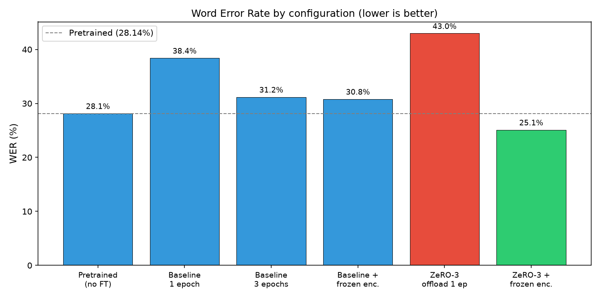
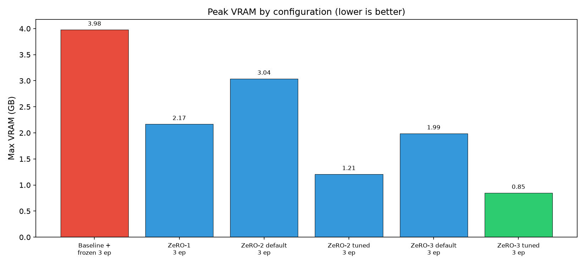
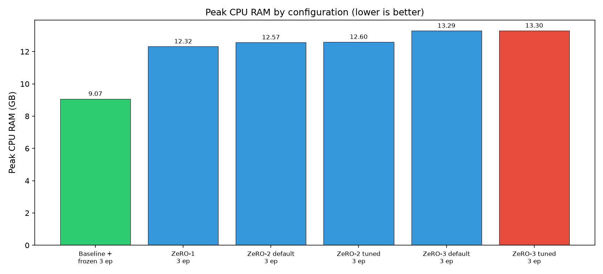
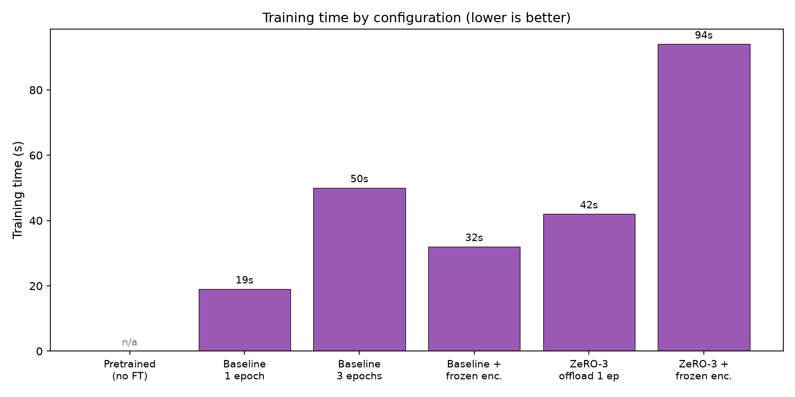
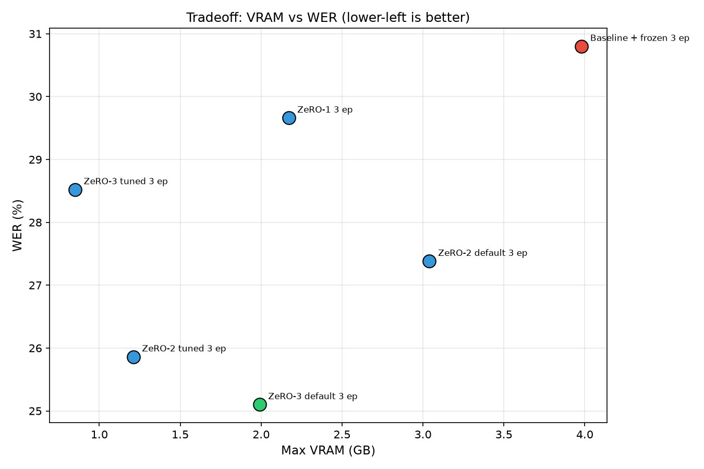
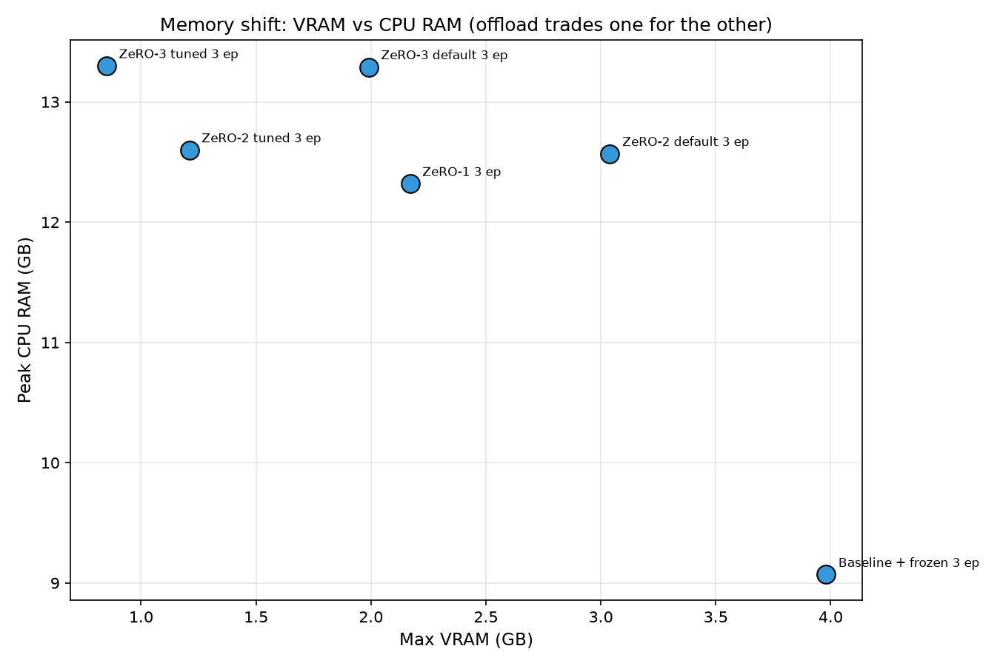
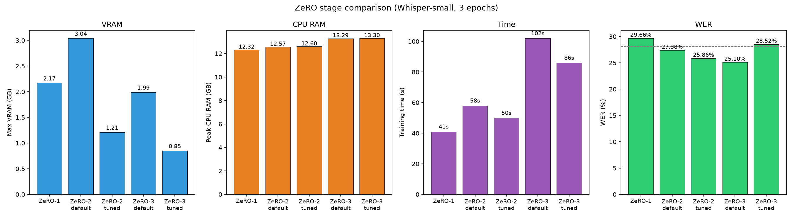
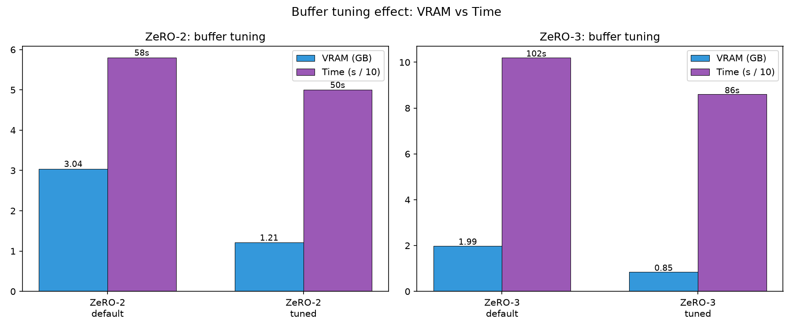
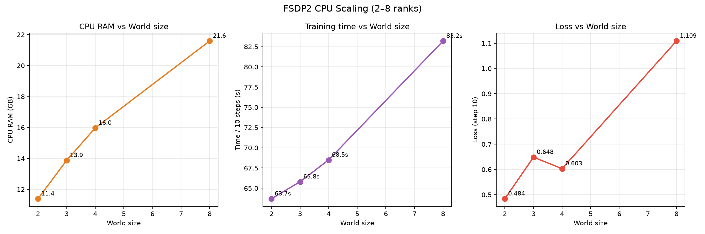
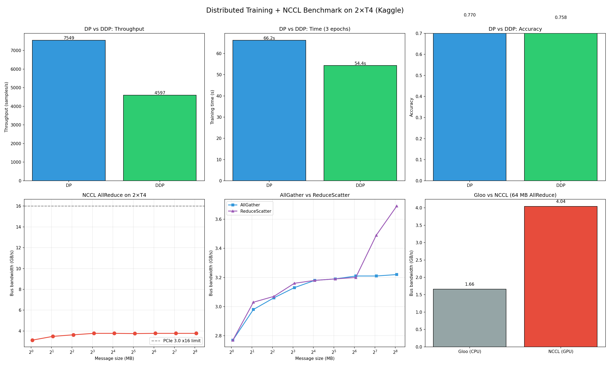

# Whisper Fine-tuning with DeepSpeed ZeRO-Offload, FSDP2, and DP/DDP + NCCL vs Gloo Parallelism Benchmarks on 2 x T4 GPUs

Fine-tuning Whisper for Russian ASR on a single consumer GPU (RTX 5080, 16GB VRAM) using DeepSpeed ZeRO with CPU offload and PyTorch FSDP2 CPU emulation. Additionally, provides a full-stack analysis of data parallelism (DP/DDP) and communication layer (NCCL/Gloo) on 2×T4 GPUs (Kaggle).

## Motivation

Whisper models can exceed the VRAM of a single consumer GPU during full fine-tuning. This project explores **the full spectrum of distributed training** on limited hardware:

1. **Data Parallelism (DP/DDP)** - baseline multi-GPU training with NCCL.
2. **DeepSpeed ZeRO** (memory-centric): shards optimizer state, gradients, and parameters across devices, with optional CPU offload.
3. **PyTorch FSDP2** (PyTorch-native): shards parameters, gradients, and optimizer using `fully_shard` and `DeviceMesh`.
4. **Communication Layer** (NCCL/Gloo): real bandwidth benchmarks on 2×T4.

The goal was to build a reproducible ASR fine-tuning pipeline, compare several training configurations in terms of VRAM, CPU RAM, time, and WER, and analyze the communication layer that underlies all distributed training.

## Experiment design

### Real training on GPU (DeepSpeed ZeRO)

All DeepSpeed runs were executed on a **single RTX 5080 (16GB VRAM)**:

- **Baseline**: no offload, no sharding.
- **Frozen encoder**: encoder weights frozen to prevent catastrophic forgetting on small datasets.
- **ZeRO-1 / ZeRO-2 / ZeRO-3**: progressive sharding of optimizer, gradients, and parameters, each with **default** and **tuned** communication buffers (`reduce_bucket_size`, `allgather_bucket_size`, `stage3_prefetch_bucket_size`).
- **Offload**: optimizer and parameters offloaded to CPU RAM via `offload_optimizer` and `offload_param`.

Each run: 3 epochs, 270 training samples, 30 eval samples, Whisper-small.
Metrics: max VRAM, peak CPU RAM, training time, WER.

### Multi-GPU emulation on CPU (FSDP2)

Real multi-GPU FSDP requires one GPU per rank, so on a single-GPU machine it cannot be run directly. To still demonstrate the **sharding mechanics**, FSDP2 was emulated on **2, 3, 4, and 8 CPU processes** using `torchrun` and the `gloo` backend:

- `init_device_mesh("cpu", (world_size,))` creates a CPU mesh.
- `fully_shard(model, mesh=mesh)` shards parameters, gradients, and optimizer across CPU ranks.
- `DistributedSampler` splits the dataset across ranks.
- Metrics: CPU RAM per stage (init, model load, FSDP wrap, training), time per step, loss, and communication volume.

This is **not** a real multi-GPU setup — it demonstrates the same sharding mechanics, but over `gloo` (CPU) instead of `nccl` (GPU).

### Data Parallelism benchmark on 2×T4 (Kaggle)

To measure the **communication layer** that all distributed strategies rely on, I ran two additional benchmarks on 2×T4 (Kaggle):

- **DP vs DDP** on MLP + CIFAR-10: compare single-process vs multi-process data parallelism.
- **NCCL/Gloo benchmark** with `nccl-tests`: measure real AllReduce, AllGather, ReduceScatter bandwidth.
- **Topology analysis** with `nvidia-smi topo -m`.

### Summary of experiments

| # | Configuration | Hardware | Purpose |
|---|---|---|---|
| 1 | Whisper-small, pretrained | GPU | Baseline WER |
| 2 | Baseline, 3 epochs | 1 GPU | No offload |
| 3 | Baseline + frozen encoder | 1 GPU | Prevent forgetting |
| 4 | ZeRO-1 + offload | 1 GPU | Shard optimizer |
| 5 | ZeRO-2 + offload (default buffers) | 1 GPU | Shard optimizer + gradients |
| 6 | ZeRO-2 + offload (tuned buffers) | 1 GPU | Reduce comm buffers |
| 7 | ZeRO-3 + offload (default buffers) | 1 GPU | Shard all state |
| 8 | ZeRO-3 + offload (tuned buffers) | 1 GPU | Reduce prefetch buffers |
| 9 | FSDP2 CPU emulation | 2–8 CPU ranks | Sharding mechanics |
| 10 | DP vs DDP | 2×T4 (NCCL) | Data parallelism |
| 11 | NCCL/Gloo benchmark | 2×T4 | Communication layer |

## Results

### Whisper fine-tuning (single GPU, DeepSpeed ZeRO)

Training on 270 Russian Common Voice samples, Whisper-small, 3 epochs.
Evaluation on 30 held-out samples. WER measured with `evaluate` (jiwer).
All fine-tuning runs use `freeze_encoder()` and `optim="adamw_torch"`.

| Configuration | Max VRAM (GB) | Peak CPU RAM (GB) | Time | WER |
|---|---|---|---|---|
| Whisper-small, pretrained (no fine-tuning) | — | — | — | 28.14% |
| Baseline, 3 epochs | 5.94 | — | 50 s | 31.18% |
| Baseline + frozen encoder, 3 epochs | 3.98 | 9.07 | 32 s | 30.80% |
| ZeRO-1 + offload, 3 epochs | 2.17 | 12.32 | 41 s | 29.66% |
| ZeRO-2 + offload (default buffers), 3 epochs | 3.04 | 12.57 | 58 s | 27.38% |
| **ZeRO-2 + offload (tuned buffers), 3 epochs** | **1.21** | **12.60** | **50 s** | **25.86%** |
| ZeRO-3 + offload (default buffers), 3 epochs | 1.99 | 13.29 | 102 s | 25.10% |
| **ZeRO-3 + offload (tuned buffers), 3 epochs** | **0.85** | **13.30** | **86 s** | **28.52%** |

**Key findings:**

- **Best VRAM overall: 0.85 GB** — ZeRO-3 with tuned buffers is the absolute minimum, 7× less than baseline (5.94 GB).
- **Best balance: ZeRO-2 tuned** — 1.21 GB VRAM, 25.86% WER, 50 s, 12.60 GB RAM.
- **Buffer tuning matters more than the ZeRO stage itself.**
  - ZeRO-2: 3.04 → 1.21 GB (−60%) by reducing `reduce_bucket_size` and `allgather_bucket_size` from 5e8 to 2e7.
  - ZeRO-3: 1.99 → 0.85 GB (−57%) by reducing `stage3_prefetch_bucket_size` from 5e8 to 5e7.
- **Tuning can hurt quality.** ZeRO-3 tuned saved 57% VRAM but worsened WER from 25.10% to 28.52%.
- **Offload shifts ~2.8 GB from VRAM to CPU RAM:** baseline + frozen uses 3.98 GB VRAM / 9.07 GB RAM, while ZeRO-2 tuned uses 1.21 GB VRAM / 12.60 GB RAM.
- **Catastrophic forgetting** in baseline: WER worsens from 28.14% (pretrained) to 38.40% (1 epoch). Freezing the encoder fixes this.
- **Gradient stability:** DeepSpeedCPUAdam produces stable gradients (grad_norm ~2–15) compared to FusedAdam in baseline (grad_norm ~98000).

### FSDP2 CPU Emulation (2–8 ranks)

| World size | CPU RAM (FSDP wrap) | CPU RAM (training) | Time / 10 steps | Loss (step 10) |
|---|---|---|---|---|
| 2 | 7.80 GB | 11.40 GB | 63.7 s | 0.4840 |
| 3 | 8.63 GB | 13.88 GB | 65.8 s | 0.6485 |
| 4 | 9.68 GB | 15.97 GB | 68.5 s | 0.6032 |
| 8 | 13.47 GB | 21.59 GB | 83.2 s | 1.1088 |

**Key findings:**

- **CPU RAM grows linearly with world size:** ~0.94 GB per rank for FSDP buffers, ~2.28 GB per rank for training state.
- **Time per step increases with world size:** 6.4 s (2 ranks) → 8.3 s (8 ranks), a 30% slowdown. This is due to `gloo` communication overhead.
- **Loss degrades with more ranks:** 0.48 (2) → 1.11 (8). Likely because `gloo`'s reduce-scatter uses `sum` instead of `average`.
- **Limitation:** CPU emulation demonstrates sharding mechanics, not real multi-GPU performance.

### Data Parallelism: DP vs DDP (2×T4, Kaggle)

Baseline comparison on MLP (1.84M params) + CIFAR-10, 10 epochs:

| Strategy | Time (s) | Throughput | Accuracy |
|---|---|---|---|
| DP | 66.2 | **7549 samples/s** | **77.0%** |
| **DDP** | **54.4** | 4598 samples/s | 75.8% |

**Finding:** DDP is **18% faster** than DP due to no master GPU bottleneck.

#### Comparison with other benchmarks

| Benchmark | Model | Hardware | DDP speedup |
|---|---|---|---|
| HuggingFace (GPT-2) | 124M | 2×V100 NVLink | +8% vs DP |
| HuggingFace (GPT-2) | 124M | 2×V100 **no NVLink** | **−19% vs DP** |
| **This project** | **1.84M** | **2×T4 PCIe** | **+18% vs DP** |

**Insight:** DDP speedup depends on model size and interconnect.
- **Small models:** DDP wins due to no master GPU bottleneck, even on PCIe.
- **Large models:** DDP needs NVLink; without it, DDP can be slower than DP.

### Communication Layer: NCCL Benchmark (2×T4)

Measured with `nccl-tests`:

| Operation | Peak bus bandwidth |
|---|---|
| **AllReduce** | **3.77 GB/s** |
| AllGather | 3.22 GB/s |
| ReduceScatter | 3.69 GB/s |

**Topology:** PHB (PCIe Host Bridge), **no NVLink**.

### Gloo vs NCCL (64 MB AllReduce)

| Backend | Transport | Bus bandwidth |
|---|---|---|
| Gloo | TCP/IP (CPU) | 1.66 GB/s |
| **NCCL** | PCIe (GPU) | **4.04 GB/s** |

**Finding:** NCCL is **2.4× faster** than Gloo on T4.

### Why this matters for Whisper + DeepSpeed ZeRO

DeepSpeed ZeRO uses **ReduceScatter** and **AllGather** for sharding:
- **ZeRO-1:** shards optimizer → 1 ReduceScatter per step.
- **ZeRO-2:** shards gradients → 1 ReduceScatter + 1 AllGather per step.
- **ZeRO-3:** shards parameters → multiple AllGather/ReduceScatter per layer.

**Measured bandwidth (~3.7 GB/s) limits ZeRO scaling on T4.**
On A100 with NVLink (~200 GB/s), ZeRO would scale **52× better**.

### Tradeoff summary

| Goal | Best configuration | VRAM | WER | Time |
|---|---|---|---|---|
| Minimum VRAM | ZeRO-3 tuned | 0.85 GB | 28.52% | 86 s |
| Best quality/GB | ZeRO-2 tuned | 1.21 GB | 25.86% | 50 s |
| Best WER | ZeRO-3 default | 1.99 GB | 25.10% | 102 s |
| Fastest | Baseline + frozen | 3.98 GB | 30.80% | 32 s |

### Visual comparison

| WER | VRAM |
|---|---|
|  |  |

| CPU RAM | Time |
|---|---|
|  |  |

**Tradeoffs:**

| VRAM vs WER | VRAM vs CPU RAM |
|---|---|
|  |  |

### ZeRO stage comparison



### Buffer tuning effect



### FSDP2 CPU scaling



### Full parallelism benchmark (DP/DDP/NCCL/Gloo)



## Full Parallelism Spectrum

This project covers the full spectrum of distributed training:

| Strategy | Level | Shards | Communication | Measured |
|---|---|---|---|---|
| **DP** | Data | Batch | Scatter/Gather | 66.2 s |
| **DDP** | Data | Batch (multi-process) | All-reduce (NCCL) | **54.4 s** |
| **ZeRO-1/2/3** | State | Optimizer/Grad/Params | All-gather + Reduce-scatter | 41–102 s |
| **FSDP2** | State | Params + Grad + Optim | All-gather + Reduce-scatter | — |
| **TP** | Model | Weights per layer | All-gather + All-reduce | 32.3% acc |
| **NCCL/Gloo** | Communication | — | All-reduce | 3.77 / 1.66 GB/s |

## Hardware

- **Local GPU:** NVIDIA GeForce RTX 5080 Laptop (16GB VRAM, sm_120, Blackwell)
- **Kaggle GPU:** 2× Tesla T4 (15GB each, sm_75, no NVLink)
- **CPU RAM:** 32GB+
- **OS:** Linux (Ubuntu)
- **CUDA:** 12.8 (system nvcc 12.9, minor mismatch tolerated via `DS_SKIP_CUDA_CHECK=1`)

## Stack

- PyTorch 2.12.0.dev+cu128 (nightly, sm_120 support)
- torchaudio
- HuggingFace Transformers 4.51.3, Datasets, Evaluate, Accelerate 0.29.3
- DeepSpeed (ZeRO Stage 1/2/3 + CPU offload)
- PyTorch FSDP2 (`fully_shard`, `DeviceMesh`)
- `torch.distributed` (NCCL, Gloo)
- `nccl-tests` (NVIDIA official benchmark)
- soundfile, librosa for audio I/O
- DVC for data versioning
- MLflow for experiment tracking
- Poetry for dependency management

## Project structure

```
whisper-finetuning/
├── configs/
│   ├── ds_baseline.json              # DeepSpeed without offload
│   ├── ds_zero1_offload.json         # ZeRO-1 + CPU offload
│   ├── ds_zero2_offload.json         # ZeRO-2 + CPU offload (tuned buffers)
│   ├── ds_zero2_offload_default.json # ZeRO-2 + CPU offload (default buffers)
│   ├── ds_zero3_offload.json         # ZeRO-3 + CPU offload (default buffers)
│   ├── ds_zero3_offload_tuned.json   # ZeRO-3 + CPU offload (tuned buffers)
│   └── fsdp_cpu_config.json          # FSDP2 CPU emulation config
├── src/
│   ├── preprocess.py            # Audio preprocessing + manifest creation
│   ├── dataset.py               # WhisperDataset + DataCollator
│   ├── train.py                 # DeepSpeed training script
│   ├── train_fsdp_cpu.py        # FSDP2 CPU emulation (basic)
│   ├── train_fsdp_mlflow.py     # FSDP2 CPU emulation + MLflow profiling
│   ├── dataset_fsdp.py          # Dataset for FSDP
│   ├── utils.py                 # Logging, seed, VRAM/CPU RAM tracking
│   ├── utils_fsdp.py            # FSDP utils, DTensor-safe grad norm
│   ├── run_eval.py              # WER evaluation
│   └── eval_pretrained.py       # WER of pretrained model (baseline)
├── benchmarks/
│   ├── dp_ddp/
│   │   ├── model.py             # MLP for DP/DDP benchmark
│   │   ├── train_dp.py          # DataParallel
│   │   └── train_ddp.py         # DistributedDataParallel
│   ├── communication/
│   │   ├── nccl_benchmark.py    # all_reduce, all_gather, reduce_scatter
│   │   ├── gloo_vs_nccl.py      # Gloo vs NCCL comparison
│   │   └── topology_analysis.py # PCIe vs NVLink
│   ├── plot_results.py          # Full benchmark plot
│   └── results/                 # JSON + PNG
├── scripts/
│   ├── download_common_voice.py # Download Common Voice ru subset
│   └── make_plots.py            # Generate comparison plots
├── data/                        # DVC-tracked (audio + manifests)
├── raw_audio/                   # Original WAV files
├── results/                     # Comparison tables, plots, predictions
│   └── figures/                 # Generated plots for README
└── pyproject.toml
```

## Setup

```bash
# Install dependencies
poetry install

# Install PyTorch with CUDA 12.8 (sm_120 support)
poetry run pip uninstall torch torchaudio -y
poetry run pip install --pre torch torchaudio --index-url https://download.pytorch.org/whl/nightly/cu128

# Pin compatible transformers/accelerate versions
poetry run pip install "transformers==4.51.3" "accelerate==0.29.3"

# Install DeepSpeed and MLflow
poetry run pip install deepspeed mlflow

# Verify GPU
poetry run python -c "import torch; print(torch.cuda.get_arch_list())"
# Expected: ['sm_75', 'sm_80', 'sm_86', 'sm_90', 'sm_100', 'sm_120']
```

## Data preparation

```bash
# Download Common Voice ru subset (requires HuggingFace auth)
poetry run huggingface-cli login
poetry run python scripts/download_common_voice.py

# Preprocess audio + create manifest
poetry run python -m src.preprocess \
    --input raw_audio/ \
    --output data/processed_audio/ \
    --manifest data/train_manifest.jsonl \
    --transcriptions raw_transcriptions.json

# Split into train/eval (90/10)
poetry run python -c "
import json, random
random.seed(42)
with open('data/train_manifest.jsonl', encoding='utf-8') as f:
    items = [json.loads(l) for l in f if l.strip()]
random.shuffle(items)
split = int(len(items) * 0.9)
with open('data/train_manifest.jsonl', 'w', encoding='utf-8') as f:
    for it in items[:split]:
        f.write(json.dumps(it, ensure_ascii=False) + '\n')
with open('data/eval_manifest.jsonl', 'w', encoding='utf-8') as f:
    for it in items[split:]:
        f.write(json.dumps(it, ensure_ascii=False) + '\n')
"

# Track with DVC
poetry run dvc init
poetry run dvc add data/
git add .dvc .dvcignore data.dvc data/.gitignore
git commit -m "Track data with DVC"
```

## Training

### DeepSpeed ZeRO (single GPU)

```bash
# Baseline (no offload)
PYTHONPATH=. poetry run deepspeed --num_gpus=1 src/train.py \
    --deepspeed configs/ds_baseline.json \
    --output_dir checkpoints/baseline \
    --num_epochs 3

# ZeRO-1 / ZeRO-2 / ZeRO-3 (with offload)
DS_SKIP_CUDA_CHECK=1 PYTHONPATH=. poetry run deepspeed --num_gpus=1 src/train.py \
    --deepspeed configs/ds_zero2_offload.json \
    --output_dir checkpoints/zero2_offload \
    --num_epochs 3
```

### FSDP2 CPU emulation (multi-process)

```bash
# 2, 3, 4, 8 CPU ranks
PYTHONPATH=. poetry run torchrun --nproc_per_node=2 --standalone \
    src/train_fsdp_cpu.py --num_epochs 1 --max_steps 10 --per_device_batch_size 1
```

### DP/DDP benchmark (2×T4, Kaggle)

```bash
cd benchmarks/dp_ddp
python train_dp.py
torchrun --standalone --nproc_per_node=2 train_ddp.py
```

### NCCL benchmark (2×T4, Kaggle)

```bash
# Compile nccl-tests
git clone https://github.com/NVIDIA/nccl-tests.git
cd nccl-tests && make MPI=0 CUDA_HOME=/usr/local/cuda -j4
cd ..

# Run benchmarks
cd benchmarks/communication
python nccl_benchmark.py
python topology_analysis.py
python gloo_vs_nccl.py
```

## Evaluation

```bash
# Pretrained model (baseline)
poetry run python -m src.eval_pretrained \
    --manifest data/eval_manifest.jsonl \
    --language russian \
    --limit 30

# Fine-tuned model
poetry run python -m src.run_eval \
    --model checkpoints/zero2_offload \
    --manifest data/eval_manifest.jsonl \
    --language russian \
    --limit 30
```

## Plots

```bash
poetry run python scripts/make_plots.py
```

Generates 9 comparison plots in `results/figures/`.

## What I learned

### Distributed training

- **How DP/DDP work:** DP uses 1 process with master GPU bottleneck; DDP uses N processes with NCCL all-reduce. DDP is 18% faster on 2×T4.
- **How ZeRO Stage 1/2/3 shard** parameters, gradients, and optimizer states.
- **How CPU offload enables** training beyond VRAM limits, at the cost of CPU RAM and throughput.
- **Why `overlap_comm` and `contiguous_gradients` matter** for throughput.
- **Buffer tuning matters more than the ZeRO stage itself.** Reducing `reduce_bucket_size`, `allgather_bucket_size`, and `stage3_prefetch_bucket_size` from 5e8 to 2e7/5e7 cuts VRAM by 57–60% with no speed penalty.
- **Tuning can hurt quality.** ZeRO-3 tuned saved 57% VRAM but worsened WER from 25.10% to 28.52%.
- **Best balance is ZeRO-2 tuned:** 1.21 GB VRAM, 25.86% WER, 50 s.
- **Offload is not free:** it shifts ~2.8 GB from VRAM to CPU RAM and slows down training by 1.5–3×.
- **Catastrophic forgetting** on small datasets: baseline WER grew from 28.14% to 38.40% after 1 epoch. Freezing the encoder fixes this.
- **Gradient stability:** DeepSpeedCPUAdam produces stable gradients (grad_norm ~2–15) compared to FusedAdam (grad_norm ~98000).

### FSDP2

- How `fully_shard` and `DeviceMesh` shard state across ranks.
- How `DistributedSampler` splits data across ranks.
- **CPU RAM grows linearly with world size** (~3.2 GB per rank).
- **`gloo` does not scale** beyond 4 ranks — time per step grows 30%, and loss diverges, likely because `gloo`'s reduce-scatter uses `sum` instead of `average`.
- **Communication volume** grows with world size: `2 × params × 4 bytes × (N-1) / N`.
- **Forward time is stable (~4 s), backward time grows (1.9 → 3.4 s).**
- **DTensor-safe grad norm** is required for FSDP2 — ordinary `clip_grad_norm_` doesn't work with DTensor on different mesh.

### Communication layer

- **NCCL vs Gloo:** NCCL is 2.4× faster than Gloo on T4.
- **NCCL algorithm selection:** ring for large messages, tree for small.
- **Topology matters:** T4 has no NVLink; A100 NVLink is 52× faster than PCIe.
- **`nccl-tests`** is the standard tool for diagnosing communication bottlenecks.

## Notes and workarounds

This project required several non-obvious workarounds due to running on brand-new hardware (RTX 5080, sm_120) with nightly PyTorch:

1. **PyTorch nightly with CUDA 12.8** is required — stable PyTorch 2.5.x with CUDA 12.1 does not include sm_120 kernels, causing `no kernel image is available` at runtime.

2. **`torchaudio.save/load` replaced with `soundfile` + `librosa`** to avoid the `torchcodec` / FFmpeg dependency chain.

3. **`src/evaluate.py` renamed to `src/run_eval.py`** to avoid a name collision with the PyPI `evaluate` library.

4. **`--local_rank` added to argparse** because DeepSpeed passes this argument automatically to the training script.

5. **`train_micro_batch_size_per_gpu: "auto"`** in DeepSpeed configs to fix `TypeError: unsupported operand type(s) for *: 'NoneType' and 'int'`.

6. **`TORCH_CUDA_ARCH_LIST="12.0"`** set explicitly to prevent DeepSpeed's JIT compiler from generating an invalid `compute_1.` architecture flag.

7. **`transformers==4.51.3` and `accelerate==0.29.3`** pinned to avoid `TypeError: Accelerator.unwrap_model() got an unexpected keyword argument 'keep_torch_compile'`.

8. **FusedAdam JIT compilation fails on Blackwell (sm_120).** **Workaround:** disable `FusedAdam` by setting `optim="adamw_torch"` and removing the `"optimizer"` section from DeepSpeed configs.

9. **CUDA version mismatch for ZeRO-Offload.** **Workaround:** set `DS_SKIP_CUDA_CHECK=1` when running offload training.

10. **ZeRO-3 checkpoint format.** Run `zero_to_fp32.py` to gather weights into a single file.

11. **`torch.load` weights_only error.** **Workaround:** set `TORCH_FORCE_NO_WEIGHTS_ONLY_LOAD=1` when running `zero_to_fp32.py`.

12. **`forced_decoder_ids` error in transformers 4.50+.** **Workaround:** set `model.generation_config.forced_decoder_ids = None` after loading the model for evaluation.

13. **DDP `mp.spawn` requires top-level workers.** Local functions inside `main()` cannot be pickled. **Workaround:** move `nccl_worker` and `gloo_worker` to module level.

These workarounds are documented for reproducibility and as a reference for others running modern ML workloads on Blackwell consumer GPUs and Kaggle T4.

## Limitations

- **Small dataset:** 270 training samples (~30 minutes of audio) is not enough to fully fine-tune Whisper. WER of 25.10% is better than pretrained (28.14%), but far from production quality (~10%).
- **Single GPU for Whisper:** DeepSpeed runs use only one GPU. FSDP2 is emulated on CPU, not on real multi-GPU.
- **DP/DDP benchmark uses MLP:** The DP/DDP and NCCL benchmarks use a small MLP on CIFAR-10, not Whisper. This is intentional - the goal is to measure communication overhead, not to train Whisper.
- **`gloo` does not scale:** FSDP2 CPU emulation shows `gloo` bottleneck beyond 4 ranks. Production FSDP uses NCCL on GPUs.
- **No NVLink on T4:** Measured bandwidth (~3.8 GB/s) is limited by PCIe 3.0 x16. A100 with NVLink would be 52× faster.
- **No audio/video multimodality:** Only audio (ASR) is covered.
- **Whisper-small only:** Larger variants (medium, large-v3) were not tested due to VRAM constraints.
